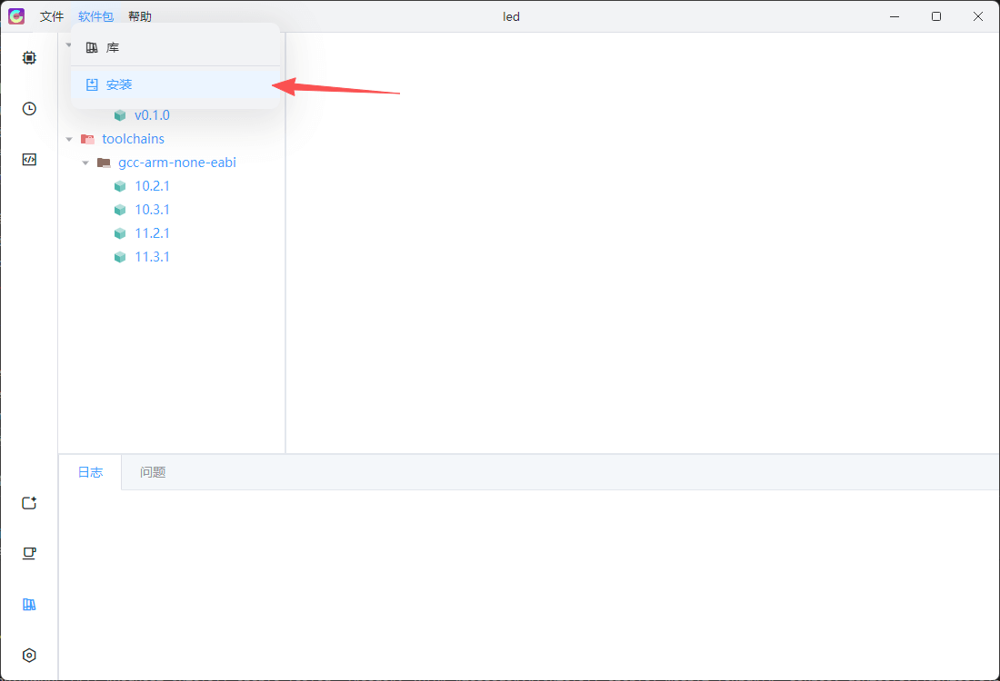
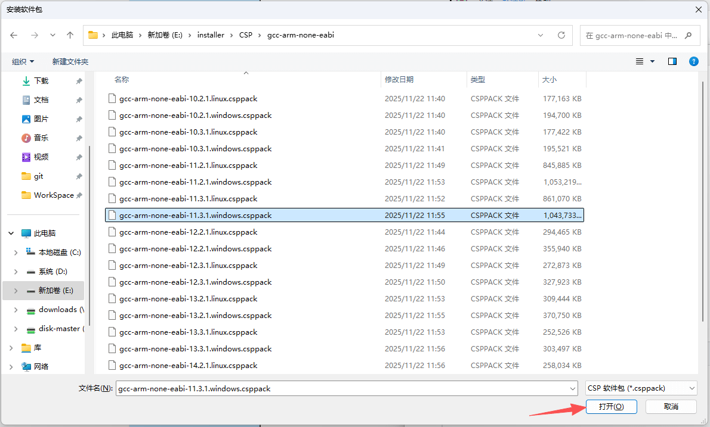
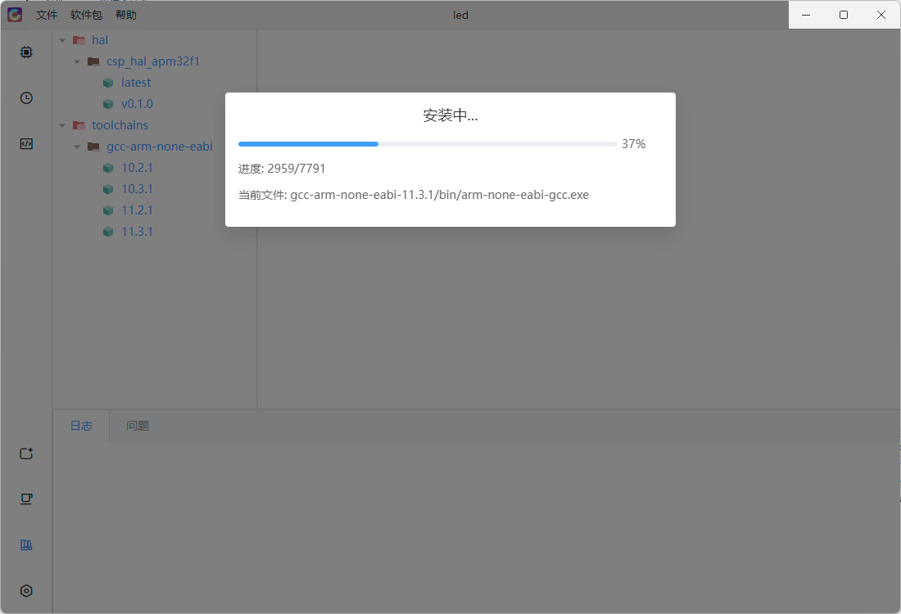
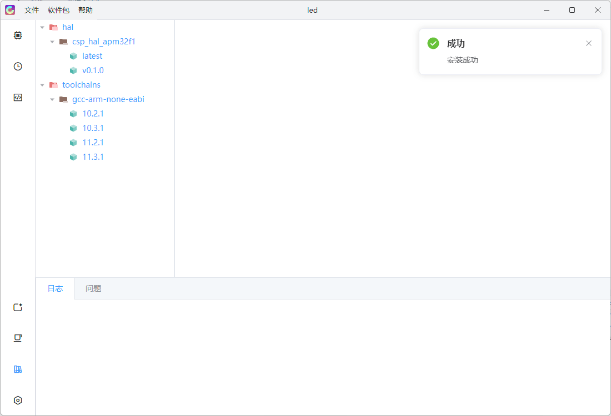
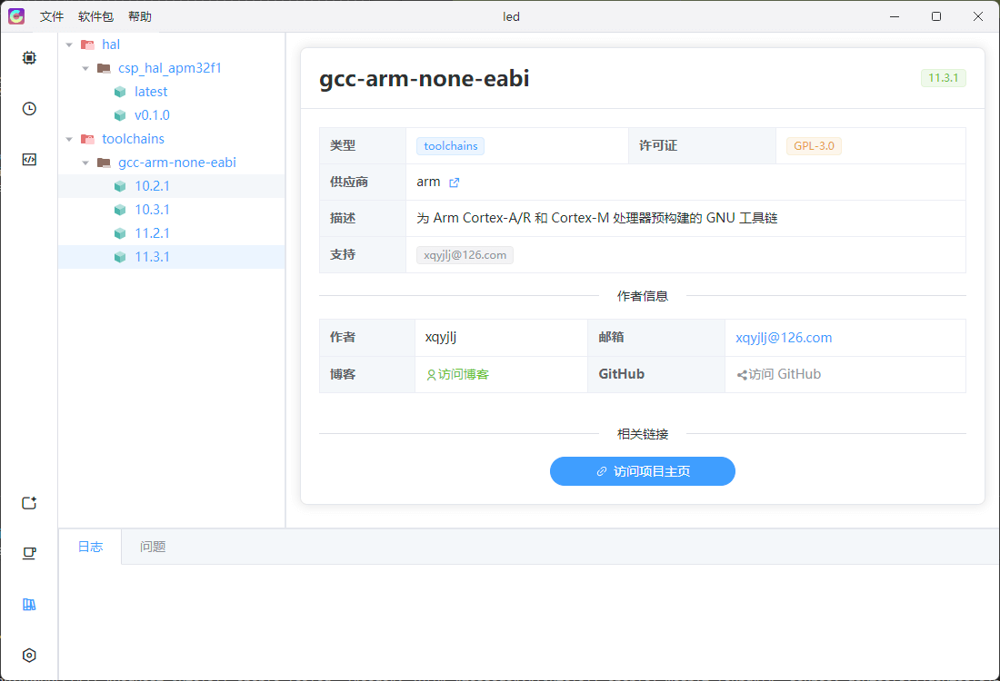

# 软件包

CSP 提供了丰富的软件包，用于扩展系统功能和支持不同芯片及开发需求。通过软件包管理功能，用户可以方便地安装、更新和查看软件包信息。

## 安装软件包

1. 打开软件包安装界面

   

2. 选择要安装的软件包

   

3. 软件包正在安装中

   

4. 软件包安装成功

   

5. 查看软件包详细信息

   

## 软件包分类

CSP 的软件包主要分为以下类型：

- [工具链](./toolchains.md) - 提供集成的编译器和工具链。如果用户不希望手动安装工具链，可直接安装此类软件包。安装后生成的工程将自动使用该工具链进行编译。
- [HAL库](./hal.md) - 芯片支持包，包含特定芯片的驱动库和示例代码。安装后可用于生成针对该芯片的应用工程，快速开发硬件驱动功能。

## 下载说明

1. **推荐使用GitHub下载**：通过GitHub Releases下载软件包可以获取最新的稳定版本，并便于跟踪更新。
2. **网盘下载**：如果网络访问 GitHub 不便，可使用提供的云盘链接下载。请确保下载文件完整无损。
3. **版本兼容性**：安装前请确认所下载的软件包版本与当前 CSP 版本兼容。不同版本之间可能存在接口或功能差异，避免因版本不匹配导致工程编译或运行错误。
